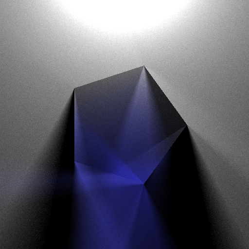
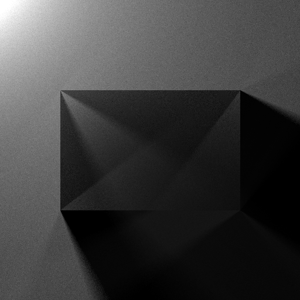
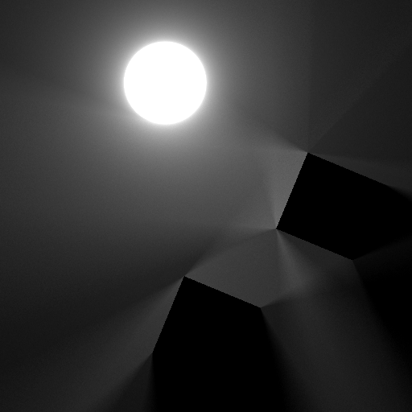
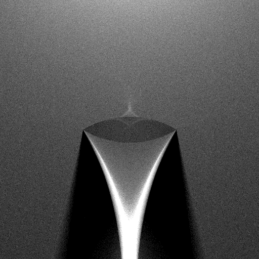
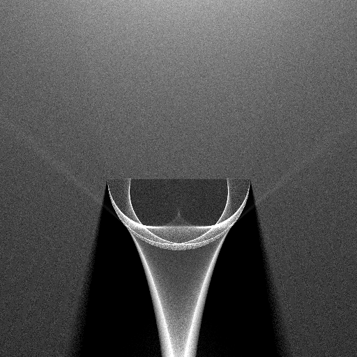

# light2d-rs
Light rendering in 2D with Rust

This project is inspired by miloyip's [Render light with C](https://zhuanlan.zhihu.com/p/30745861) series (Chinese) and follows his idea generally, but I made some changes:

1. Use [rayon](https://crates.io/crates/rayon) to run tracing in parallel.
2. Replaced ray marching with ray tracing to reduce the time complexity. (You can still find the ray marching version at the [master branch](https://github.com/codeworm96/light2d-rs/tree/master).)
3. Apply the Beer-Lambert law for paths inside media only.

## Examples

